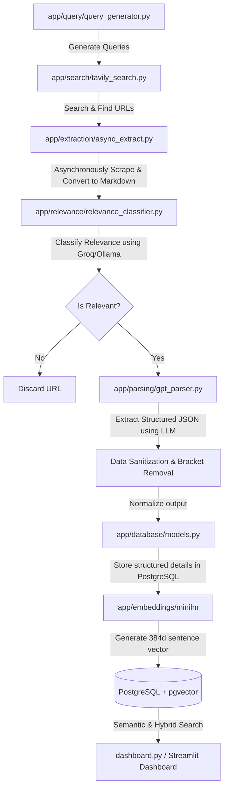

# 🚀 Investor Intelligence Pipeline

An AI-native semantic and structured venture capital discovery pipeline. It automatically searches the web, crawls investor websites, classifies relevance, extracts structured profiles using advanced LLM routing, and indexes everything into a PostgreSQL database with **pgvector** for high-precision semantic matching and hybrid retrieval.

---

## 🗺️ System Architecture

The following diagram illustrates the end-to-end data flow, from dynamic query generation to interactive semantic search:



---

## ✨ Key Technical Features

### 1. Robust Hybrid LLM Routing Engine (Groq + Ollama Fallback)
* **Primary Engine**: Leverages the lightning-fast **Groq API** (`llama-3.3-70b-versatile`) for highly accurate extraction and relevance classification.
* **Seamless Local Fallback**: If Groq encounters API limits, network interruptions, or invalid credentials, the system automatically falls back to a local **Ollama** instance running `qwen2.5:3b`.
* **Windows Loopback Native**: Uses a custom `urllib.request` standard-library HTTP integration to interact with Ollama on `127.0.0.1:11434`, completely bypassing `ollama-python` library asynchronous socket calls that trigger loopback hangs on Windows environments.

### 2. High-Fidelity Data Normalization & Sanitization
* Smaller local models can occasionally output lists inside single fields or produce malformed syntax payloads (e.g., `['a','ab','ac'a,ab'']`).
* The extraction pipeline employs an advanced `normalize_output()` sanitization layer:
  * **AST Safe Evaluation**: Evaluates legal list-of-string syntax and automatically extracts the first item into singular database text columns.
  * **Fallback Bracket Purger**: Catches syntax errors, removes brackets, splits tokens by commas, and cleans up surrounding quotes, transforming highly nested strings directly into clean, single text records (e.g., `['Accel Partners']` -> `Accel Partners`).

### 3. Asynchronous Extraction & Markdown Conversion
* Runs fully asynchronous network requests utilizing `asyncio` and custom timeout bounds to concurrently scrape hundreds of seed webpages and convert raw HTML to clean markdown for downstream LLMs.

### 4. Semantic Search with pgvector
* Configures and creates 384-dimensional database-native vector spaces.
* Runs a local SentenceTransformers sentence embedder to perform ultra-fast Cosine similarity searches, matching your natural-language startup pitches directly against structured investor focus areas.

---

## 🛠️ Tech Stack & Requirements

* **Core**: Python 3.10+
* **Database**: PostgreSQL 15+ with `pgvector` extension
* **LLM Services**: Groq Cloud API, Ollama (Local)
* **Search Engine**: Tavily API
* **Vector Embeddings**: SentenceTransformers (`all-MiniLM-L6-v2`)
* **Front-End Dashboard**: Streamlit (Sleek Dark Mode UI)

---

## 🚀 Installation & Setup

### 1. Clone the Repository
```bash
git clone https://github.com/PandiKabilesh2006/Investor-Intelligence-Pipeline.git
cd Investor-Intelligence-Pipeline
```

### 2. Set Up Python Environment
Create and activate a virtual environment, then install project dependencies:
```bash
python -m venv venv
venv\Scripts\activate  # On Windows
source venv/bin/activate  # On macOS/Linux

pip install -r requirements.txt
```

### 3. Install pgvector on Windows PostgreSQL
If you are running PostgreSQL on Windows and need to build/install the `pgvector` extension:
1. Ensure your PostgreSQL server directory is on your system path.
2. Locate your PostgreSQL port (default is configured for `1234` with password `2111`).
3. Run the automated installer script included in this repository:
```powershell
.\install_pgvector_windows.cmd
```
*(This downloads, compiles, and installs pgvector directly into your local PostgreSQL installation.)*

### 4. Configure Environment Variables
Create a `.env` file in the root directory by copying the example template:
```bash
cp .env.example .env
```
Fill in the configuration parameters inside `.env`:
```ini
DB_HOST=localhost
DB_PORT=1234
DB_NAME=postgres
DB_USER=postgres
DB_PASSWORD=2111

# LLM & Search Credentials
TAVILY_API_KEY=your-tavily-api-key
GROQ_API_KEY=your-groq-api-key
```

### 5. Initialize the Database Schema
Generate the relational tables and vector columns:
```bash
python create_tables.py
```

---

## 🏃 Running the Application

### 1. Launch Ingestion Pipeline
Execute a complete automated cycle of query generation, web discovery, relevance classification, structured parsing, embedding generation, and DB ingestion:
```bash
python run_pipeline.py
```

### 2. Run Scheduled Ingestion
To spin up a continuous background scheduler that executes the pipeline automatically at regular intervals (e.g. nightly):
```bash
python scheduler.py
```

### 3. Launch the Interactive Search Dashboard
Start the gorgeous dark-themed Streamlit user interface to run semantic and structured queries against your ingested dataset:
```bash
streamlit run dashboard.py
```

---

## 🧪 Verification & Testing

The repository contains automated tests to verify parsing robustness and fallback mechanisms:

### Verify LLM Routing & Failovers
Ensure that Groq works, and that the Ollama standard library HTTP connection seamlessly fallbacks if Groq fails:
```bash
python test_llm_fallbacks.py
```

### Verify Normalization & Malformed Bracket Stripping
Ensure that bracketed string lists and syntax-corrupted LLM outputs are successfully parsed and saved as clean strings:
```bash
python test_malformed_firm_payload.py
```

### Verify Semantic Search
Ensure that your local PostgreSQL instance successfully calculates cosine distances on generated vector embeddings:
```bash
python test_semantic_search.py
```